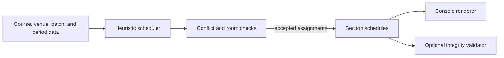

# University Timetable Generator

This Python project generates section timetables from course loads, instructor availability, room types, days, and period blocks. Its scheduler is a deterministic, heuristic constraint builder: it prefers balanced day loads and consecutive periods while rejecting room, section, instructor, and course conflicts.

## Implemented concepts

- Subject definitions with lecture/tutorial/practical/skill hours.
- Theory and lab venue inventories.
- Multiple sections/batches scheduled across Monday-Saturday and eight periods.
- Preference for practical work in lab rooms and other classes in theory rooms.
- Conflict checks for section, faculty, and room occupancy.
- A separate validator module for venue, batch, tutor, credit-load, and spatial integrity checks.
- Console rendering of each section's generated timetable.

## Scheduling flow



## Run

Prerequisite: Python 3.10+ (the code uses built-in generic type syntax).

From the repository root:

```bash
python -m project.GENERATE_TIME_TABLE
```

The generator prints one timetable for each configured batch. The source tree has no third-party dependencies and no `requirements.txt` file.

## Project structure

```text
project/
  MODULES.py                 Subject, Venue, and Batch data classes
  DATA.py                    configured courses, rooms, batches, and slots
  schedular.py               deterministic heuristic scheduler
  CONSTRAINS.py              local conflict validation used by the scheduler
  validator.py               optional global integrity checks
  GENERATE_TIME_TABLE.py     console entrypoint and renderer
  GITN.py                    additional availability helpers
  MAIN.py                    standalone data-class exercise retained in the repo
```

## Engineering notes

- `random.seed(42)` is set so the scheduling decisions remain reproducible if randomized behavior is added to the search process.
- The scheduler is heuristic, not an optimal solver; it can return `None` when the configured constraints cannot be satisfied.
- `validator.py` is available for post-generation audits, but the console entrypoint currently renders the generated schedule directly.
- No automated test suite or benchmark harness is included in the current repository.

## Author

**Karkala Shiva Reddy** — [GitHub](https://github.com/karkalashivareddy)
